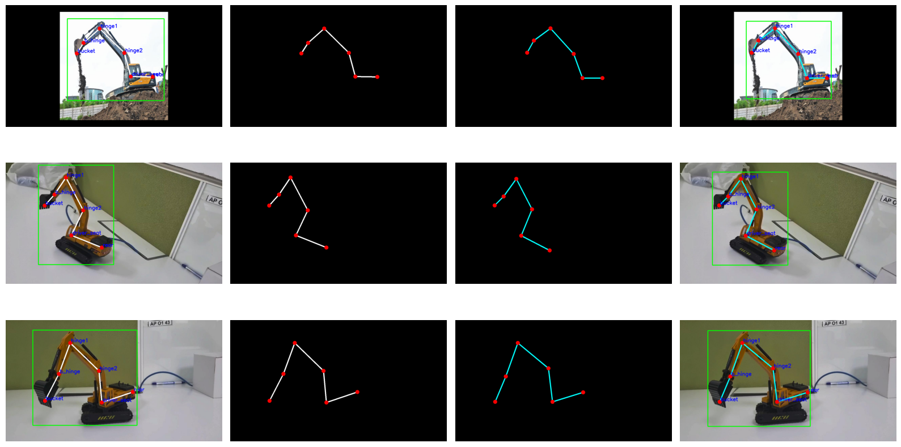

# mmpose Excavator Keypoints Detection using HRNet with RTMDet

This repository contains keypoints detection project focused on **Robotic like Machine, Excavator** with **6 keypoints** using **HRNet**.

---

## 🧭 Dataset Overview

Total train images: 642 / Total val images: 54

✅ keypoint_names = [ 'bucket', 'hinge1', 'hinge2', 'driver_seat', 'rear', 'b_hinge' ]  
✅ skeleton = [ (1,6), (2,3), (3,4), (4,5), (6,2) ] 

---

## 🏗️ Model Architecture

- 🦾 Model: **HRNet**
- 🦾 Type: **Top-down**
- 🦾 Det Model: **RTMDet**
- 🦾 Weight: **"td-hm_hrnet-w32_8xb64-210e_ubody-coco-256x192"**
- 🦾 Framework: **PyTorch + mmpose**
- 🦾 Input Size: **192, 256**
- 🦾 Trained Epochs: **20**

---

## 🎨 Visualization Samples

The model outputs of **validation set** are visualized:

📌 Example of val:
  

---
